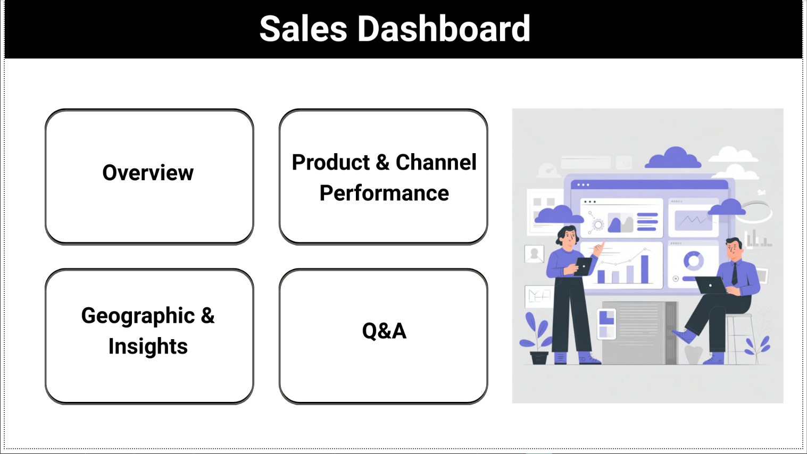

# Sales Analysis Dashboard

## Overview

This project presents an end-to-end **Sales Analysis Dashboard** built using **Power BI**, supported by data preprocessing and analysis in Python.

The dashboard provides actionable insights into:

* Revenue trends
* Customer purchasing behavior
* Product performance
* Geographic distribution
* Profitability analysis

It is designed with a **modern interactive UI (Canva-based design + Power BI interactivity)** to simulate a real-world business dashboard.

---

## Tools & Technologies

* **Power BI** – Dashboard development & visualization
* **Python (Pandas, Matplotlib, Seaborn)** – Data cleaning & analysis
* **Jupyter Notebook** – Exploratory Data Analysis (EDA)
* **GitHub** – Version control & project sharing

---

## Project Structure

```
sales_analysis_dashboard/
│
├── Sales_analysis.pbix          # Power BI dashboard file
├── sales_analysis.ipynb         # Data analysis & preprocessing
├── dashboard_preview.png        # Dashboard screenshot
└── README.md                   # Project documentation
```

---

## Key Features

### 1. Sales Overview

* Monthly revenue trends
* Order distribution analysis
* Average order value insights

---

### 2. Product & Channel Performance

* Top-performing products
* Revenue contribution by category
* Channel-wise sales comparison

---

### 3. Geographic Insights

* Sales distribution across regions
* Location-based performance tracking

---

### 4. Profitability Analysis

* Profit vs Revenue relationship
* Profit margin distribution
* High-margin product identification

---

### 5. Advanced Visualizations

* **Scatter Plot** → Unit Price vs Profit Margin
* **Histogram** → Order value distribution (spending tiers)
* **Trend Charts** → Time-series analysis

---

### 6. Interactive UI Features

* Custom **Canva-designed home page**
* Page navigation using clickable UI elements
* Dynamic **filters (Year & Month slicers)**
* **Expandable filter panel (bookmark-based UI)**
* Reset filters button

---

## Key Insights

* Revenue stays fairly stable between about 23M and 26.5M from 2014 to 2017, with no strong seasonal spikes. The sharpest drop is around 21.2M in early 2017, which may point to a one-time issue.

* Channel contribution is led by Wholesale (54%), followed by Distributors (31%) and Exports (15%). This suggests exports have room to grow.

* Top revenue-generating products are Product 26 (118M), Product 25 (110M), and Product 13 (78M). Lower performers are in the 52M–57M range.

* Profit margins vary widely from about 18% to 60%, and there is no strong link between unit price and profit margin. The repeated horizontal bands suggest fairly standardized pricing tiers.

* There is no very strong monthly volume pattern, though sales volume rises slightly around May–June. The early 2017 dip appears again here and is worth investigating.

* Regionally, California is the strongest market with around 230M revenue and 7500+ orders. Illinois, Florida, and Texas form the next tier, while New York and Indiana are comparatively lower.

---

## How to Use

1. Download the `.pbix` file
2. Open in **Power BI Desktop**
3. Navigate through pages using the home screen
4. Use filters to explore data dynamically

---

## Dashboard Preview



---

## Project Highlights

* End-to-end analytics workflow
* Clean and interactive UI design
* Real-world business insights
* Strong focus on usability & storytelling

---


